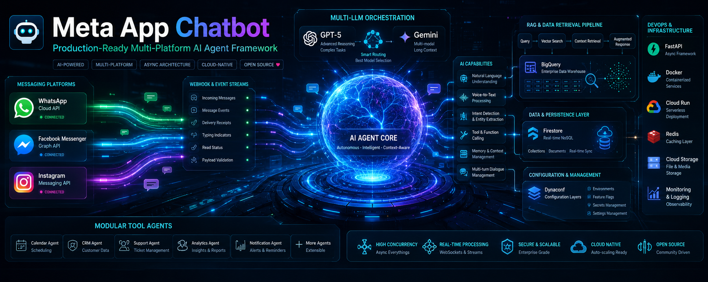

# 🚀 Meta App Chatbot - Advanced WhatsApp & Facebook AI Agent

<p align="center">
  
</p>

[](https://opensource.org/licenses/MIT)
[](https://www.python.org/downloads/)
[](https://fastapi.tiangolo.com/)
[](https://github.com/astral-sh/ruff)

An asynchronous, high-concurrency WhatsApp, Facebook, and Instagram AI agent framework designed for production. Built with **Multi-LLM support (GPT-4o, Gemini 2.0)**, **Vector RAG (BigQuery)**, and **Modular Router-based Architecture**.

[**Explore the Documentation 📖**](docs/index.md)

---

## ✨ Key Features

*   **🧠 Intelligent Reasoning**: Leverages state-of-the-art models via LangGraph for complex decision making.
*   **📊 Enterprise RAG**: Real-time Retrieval-Augmented Generation using Google BigQuery Vector Search.
*   **🧩 Modular Architecture**: Clean FastAPI router-based design for separation of concerns.
*   **🛠️ Tool-Agent System**: Easily extendable with custom tools using standard `@tool` decorators.
*   **⚡ High Performance**: Fully asynchronous I/O with `httpx` and `aiohttp`.
*   **📱 Unified Messaging**: Process WhatsApp Cloud API and Facebook Page messages through a single gateway.
*   **⚙️ Modern Config**: Powered by **Dynaconf** for robust, multi-environment `.toml` configuration.
*   **🎙️ Voice AI**: Built-in support for audio processing and speech-to-text integration.

---

## 📁 Project Structure

```text
.
├── meta_app_chatbot/
│   ├── agent/                 # Core AI Logic, Sub-Agents & Tools
│   ├── db/                    # Database & RAG Factory (Firestore, BigQuery)
│   ├── config/                # Centralized configuration (Settings & Schemas)
│   ├── routers/               # FastAPI Routers (Webhooks, Media, API)
│   ├── prompts/               # Structured LLM instructions (.md templates)
│   ├── voice/                 # Audio processing and STS/STT services
│   └── main.py                # App entrypoint & middleware configuration
├── docs/                      # Detailed system documentation
├── assests/                   # Project assets and branding
├── Dockerfile                 # Production container setup
└── pyproject.toml             # Project metadata and dependencies
```

---

## ⚙️ Quick Start

### 1. Installation

Requires [Python 3.12+](https://www.python.org/downloads/).

```bash
# Clone the repository
git clone https://github.com/mohamed-em2m/meta-bot.git
cd meta-bot

# Set up virtual environment
python -m venv .venv
source .venv/bin/activate  # Windows: .venv\Scripts\activate

# Install dependencies
pip install -r requirements.txt
playwright install chromium # Required for dynamic scraping tools
```

### 2. Configuration

Configuration is managed via **Dynaconf**.

1.  Navigate to `meta_app_chatbot/config/`.
2.  Duplicate `settings.toml.example` as `settings.toml`.
3.  Add your credentials:

```toml
[default]
OPENAI_API_KEY = "sk-..."
GEMINI_API_KEY = "AIza..."
WHATSAPP_ACCESS_TOKEN = "EAA..."
# Add other platform-specific keys as needed
```

---

## 🚀 Development & Quality

This project maintains high code quality standards through strict linting:

*   **Linting**: [Ruff](https://github.com/astral-sh/ruff) for lightning-fast Python linting and formatting.
*   **Hooks**: [Pre-commit](https://pre-commit.com/) ensures all commits meet quality gates.

To run lints manually:
```bash
ruff check .
pre-commit run --all-files
```

---

## 🏗️ Architecture Highlights

### Distributed Webhook Handling
Specialized routers decouple incoming platform payloads from the agent's internal state, allowing for easy addition of new platforms.

### Atomic Tool Design
Tools are defined as isolated Python functions, making the agent's capabilities easy to test and safe to update without touching core logic.

### Scalable Persistence
Conversation history is managed via Google Firestore, ensuring horizontal scalability and low-latency state retrieval.

---

## 🤝 Contributing

We welcome contributions of all sizes!

1.  Fork the repository.
2.  Create your feature branch (`git checkout -b feature/AmazingFeature`).
3.  Ensure lints pass (`ruff check .`).
4.  Commit your changes.
5.  Push to the branch and open a Pull Request.

---

## 📄 License

Distributed under the MIT License. See [LICENSE](LICENSE) for more information.

---

**Made with ❤️ for the AI & Open Source Community**
