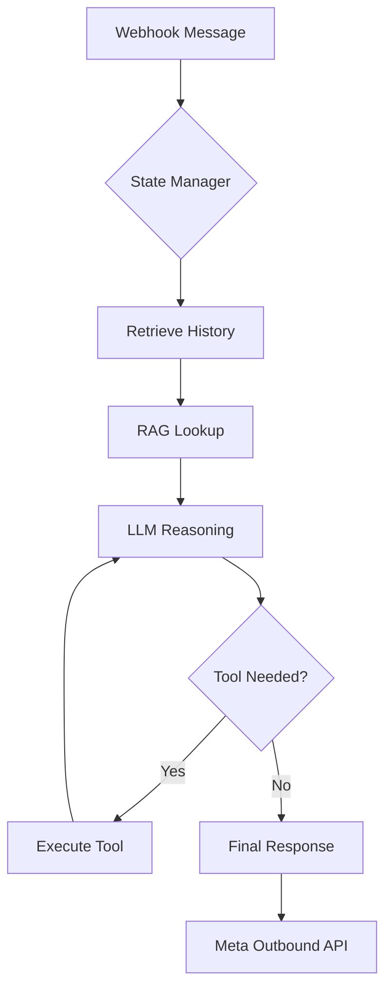

# 🏗️ Architecture & Core Logic

The Meta App Chatbot is designed as a **Modular Agent Framework**. Unlike simple request-response bots, it uses a reasoning loop to decide how to handle each message.

!!! tip "Design Principle"
    The framework favors composition over inheritance. Tools, agents, and databases are all hot-swappable via the configuration layer.

---

## 🧩 Core Components

### 1. The Main Agent Orchestrator

The `Main Agent` is the brain of the system. Its primary responsibilities include:

- **Intent Extraction**: Understanding what the user wants.
- **Context Management**: Retrieving historical messages from Firestore to maintain conversation flow.
- **Tool Dispatching**: Selecting the right tool for the job.

### 2. Multi-LLM Model Factory

The system is model-agnostic. Via the `Model Factory`, you can swap between:

- **OpenAI**: GPT-4o, o1.
- **Google Gemini**: Gemini 1.5 Pro, 2.0 Flash.
- **Vertex AI**: Enterprise-grade Google Cloud LLMs.

### 3. BigQuery RAG Pipeline

Retrieval-Augmented Generation (RAG) empowers the agent with domain-specific knowledge without fine-tuning.

- **Indexing**: Data is stored in BigQuery tables.
- **Retrieval**: Fetches relevant context based on vector similarity.
- **Injection**: Context is added to the system prompt as "Ground Truth Facts."

---

## 🛠️ Extending Tools

Adding a new tool is straightforward. A tool is a Python function decorated with `@tool`.

=== "Python"
    ```python
    @tool
    def check_inventory(product_name: str) -> str:
        """Useful for checking if a product is in stock."""
        # Your logic here (e.g., API call to Odoo or Database)
        return f"We have 10 units of {product_name} in stock."
    ```

=== "Registration"
    Tools are automatically discovered if they are in the `agent/tools` directory and properly imported.

---

## 🔄 The Reasoning Loop


